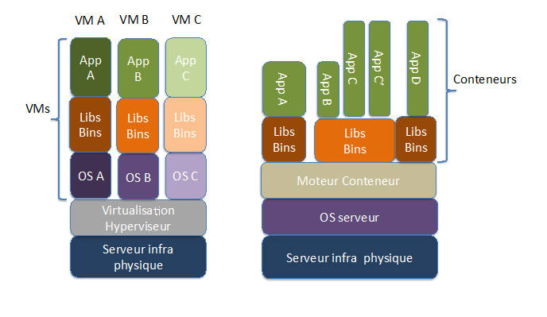
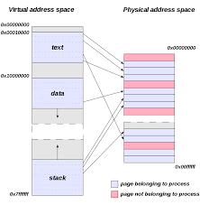
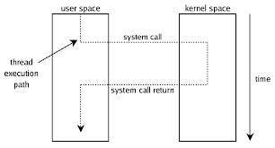

# Introduction

Docker et la conteneurisation sont souvent comparés à la virtualisation 
(VMWare, etc.),
mais les différences sont, à y regarder de plus près, bien plus nombreuses
que les ressemblances.

Dans le cas de la virtualisation, l'objectif est de faire croire à un OS
qu'il dispose d'une machine (CPU, RAM, périphériques) pour lui seul.
L'OS est un véritable OS qui va, au travers de son noyau, prendre en charge
totalement la machine et fournir des services de gestion
de la mémoire et du CPU sous la forme de processus.

Dans le cas de la conteneurisation, l'objectif est ici de faire croire à un
ou plusieurs processus qu'ils sont seuls à s'exécuter sur un OS.
C'est finalement pas la machine mais l'OS qui est virtualisé.

En quoi un gestionnaire de conteneurs aide à isoler les processus ?
Est ce que l'OS n'isole pas déjà les processus entre eux ?
Par exemple, est ce qu'un processus peux écrire dans la mémoire d'un autre
processus ?

Avec un OS moderne, c'est bien évidemment impossible, la mémoire est 
virtualisée directement par le processeur (et son [MMU](https://en.wikipedia.org/wiki/Memory_management_unit)), chaque processus ne
peut accéder qu'à la mémoire qui lui est allouée. La virtualisation de la 
mémoire permet également d'empêcher un processus d'accéder directement au 
matériel qui est généralement accessible au travers de registres dans 
l'espace d'adressage physique du processeur.

L'ensemble de la communication d'un processus avec le monde extérieur se
fait par l'intermédiaire d'appels systèmes, qui font sauter l'exécution du
processus de son espace d'adressage à celui du noyau. La vision qu'à un
processus des différentes ressources qu'il accède aux travers des appels
systèmes (réseau, fichiers, etc.) peut aussi être virtualisée.

Sous Linux cela se fait principalement à l'aide du mécanisme de
[namespaces](https://en.wikipedia.org/wiki/Linux_namespaces).
