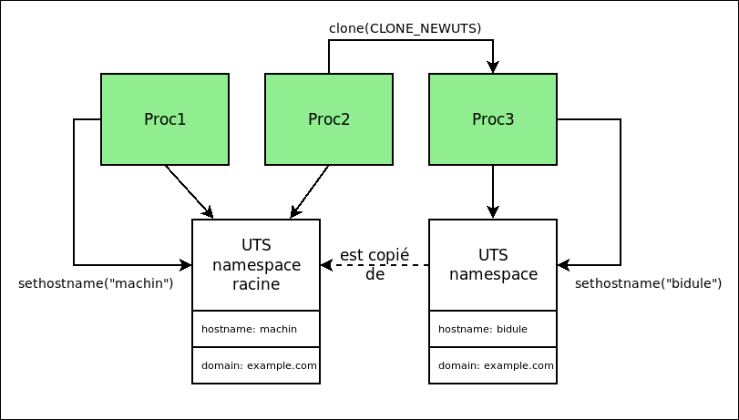

# Docker sans Docker

A l'aide du mécanisme de namespace de Linux, il est possible de controller
les resources visibles d'un processus et de l'isoler encore un peu plus.

Les namespaces sont organisés sous forme d'arbre, un namespace hérite
(dans la plupart des cas) des propriétés de leur parent.

La commande `unshare` permet de controller la création de namespaces
lors de la création d'un processus (`man unshare` pour un exemple 
d'utilisation). En fonction des options les droits root peuvent être
nécessaires (l'option `--map-root-user` permet généralement de s'en passer).

Par exemple pour lancer un shell complètement isolé de ses namespaces
parents :
```
% unshare --mount --uts --ipc --net --pid --fork --user --map-root-user bash
```

Sous le capot, la commande `unshare` utilise l'appel système [`clone`](http://man7.org/linux/man-pages/man2/clone.2.html),
similaire à `fork`, mais qui permet de controller la création de nouveaux namespaces.



`proc1` et `proc2` partage le namespace UTS par défaut. Par contre `proc3`
dispose de son propre namespace, il peut modifier les propriétés associées
à ce namespace sans que les effets soient visibles des autres processus.

## Le namespace UTS

Le namespace UTS permet d'isoler les noms de machine et de domaine
(hostname et domainname).

Essayer de changer le nom de la machine dans un shell possédant un nouveau 
namespace UTS et vérifié que le namespace racine n'est pas impacté.
Utiliser la commande `hostname` pour voir et changer le nom de machine.

```
% sudo unshare --uts bash
```

## Le namespace PID

Le namespace PID permet d'avoir une numérotation des processus distincte de
celle de son namespace parent.

```
% unshare --fork --pid bash
% echo $$
% ps aux
```

Remarquer que la valeur `$$` (PID du shell courant) vaut bien 1,
par contre la commande `ps` donne une valeur bien différente. En fait
la commande ps utilise le système de fichier `/proc` pour afficher le
listing des processus, qui est toujours celui du namespace racine.
Il est possible d'utiliser l'option `--mount-proc` qui montera le
système de fichier `/proc` correspondant au nouveau namespace PID
(cela créer aussi un namespace de type mount, mais plus la dessus
tout de suite après).

```
% unshare --fork --pid --mount-proc bash
% echo $$
% ps aux
```

Magie ! Seuls les processus enfants du shell sont maintenant affichés.
avec la numérotation propre au namespace courant.

## Le namespace mount

Le namespace mount permet (comme son nom l'indique) d'avoir des montages
de systèmes de fichiers distinct du namespace parent.

Désarchiver `busybox.tar.gz` :
```
% tar xvfz busybox.tar.gz
```

Lancé un shell avec un namespace mount isolé et vérifier que le nouveau
montage n'est visible que du shell:
```
% unshare --mount bash
% mount -o bind busybox /mnt
% ls /mnt
```

Si l'on veut que le répertoire `busybox` soit le
répertoire racine du shell, il faut utiliser la bonne vielle commande 
`chroot` (ou `pivot_root`) :

```
% unshare -r chroot busybox sh
```

Le namespace mount permet simplement de rendre local au namespace toute
manipulation de montage avec la commande `mount`.

## Le namespace net

Le namespace net permet d'isoler l'ensemble des fonctionnalités réseau :
* les interfaces réseau (`ifconfig` ou `ip`)
* la table de routage (`route`)
* la configuration du firewall (`iptables`)

Shell 1:
```
% unshare -r -n bash
% ifconfig -a
% echo $$
```

Le nouveau namespace dispose d'une seule interface de type loopback 
désactivée. Il n'est pas possible d'y ajouter des interfaces physiques,
mais on peut y ajouter des interfaces virtuelles de type veth. Ce
type d'interface fonctionne comme un *pipe* où chaque extrémité est
une interface réseau.

Shell 2:
```
% sudo ip link add veth0 type veth peer name eth0 netns ${PID_du_bash}
% sudo ifconfig veth0 10.1.1.1/24 up
```

Les interfaces sont crées par paire, `veth0` est placée dans le namespace par 
défaut tandis que `eth0` est placée dans le namespace net du processus dont
le PID est donné en paramètre.

Shell 1:
```
% ifconfig -a
% ifconfig eth0 10.1.1.2/24 up
% ping 10.1.1.1
% python -m SimpleHTTPServer
```

La nouvelle interface `eth0` est maintenant visible dans le shell isolé
et est configurable avec une IP et un masque.

Shell 2 (ou dans un navigateur):
```
% route -n
% curl http://10.1.1.2:8000
```

Le service déployé dans le shell isolé est accessible au travers de
l'interface `veth0` car une route est automatiquement créée pour le 
sous-réseau `10.1.1.0`.

## Autres namespaces

* IPC
* user
* cgroup

# Conclusion

Les fonctionnalités d'isolation de processus sont directement
fournit par le noyaux sans outils supplémentaires. Mais l'isolation
directe à partir de namespaces est extrêmement compliqué à configurer,
les gestionnaires de conteneurisation (LXC, Docker, rt) permettent de 
grandement simplifier ce travail.

# Liens

* [Introduction au namespaces Linux](http://billauer.co.il/blog/2015/07/linux-namespaces-unshare/)

* [Docker without Docker](https://ilearnedhowto.wordpress.com/tag/unshare/)

* [Network NS](https://blog.scottlowe.org/2013/09/04/introducing-linux-network-namespaces/)

## [Suivant](Docker.html)